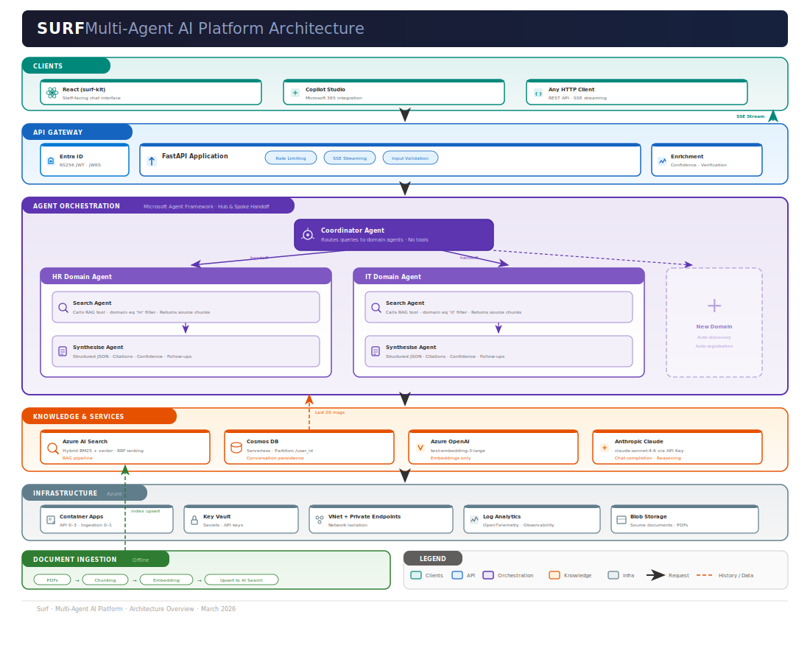
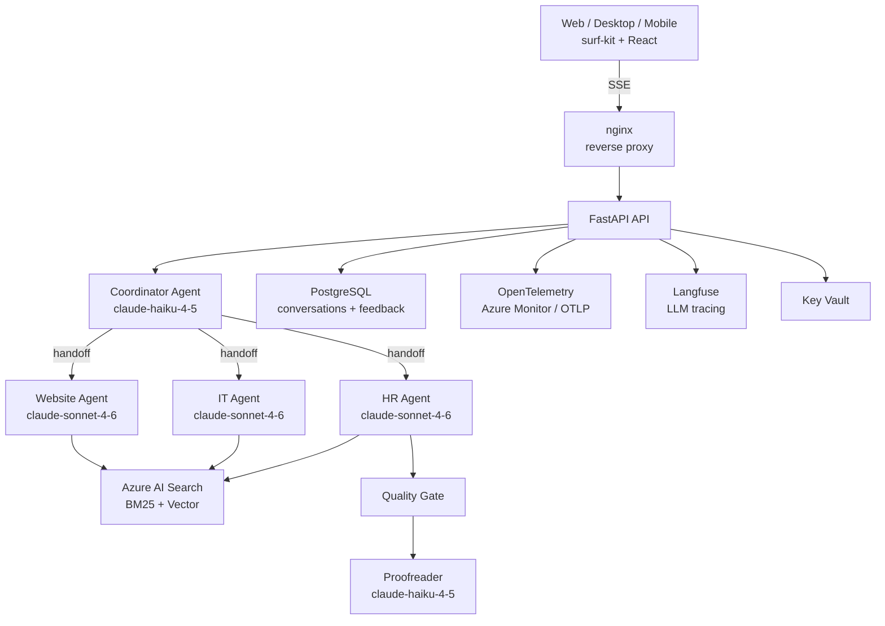

<div align="center">
  

# surf

**The open framework for extensible, grounded AI agent orchestration.**

Build multi-agent systems that route queries to specialist agents, ground every answer in your own knowledge base, and ship across web, desktop, and mobile from a single codebase.

_FastAPI · Anthropic Claude · Azure RAG · PostgreSQL · React · Tauri · Expo_

[](https://github.com/barney-w/surf/actions/workflows/pr-checks.yml)
[](https://www.python.org/)
[](https://github.com/barney-w/surf-kit)
[](./LICENSE)

[Architecture](#architecture) · [Quick Start](#quick-start) · [Agents](#agents) · [Security](#security-model) · [Development](#development) · [Contributing](./CONTRIBUTING.md)

</div>

---

## What Makes Surf Different

Most agent frameworks stop at prompt chaining. Surf is an end-to-end orchestration platform that treats **grounding**, **security**, and **observability** as first-class concerns — not afterthoughts.

- **Zero-registration agents** — subclass `DomainAgent`, and the framework discovers, registers, and wires your agent automatically via `__init_subclass__` (`api/src/agents/_base.py`). No config files, no manual plumbing.
- **Auth-filtered agent graphs** — agents are invisible to users who lack the required auth level. The coordinator can't even describe or route to agents the caller isn't authorised to access (`api/src/orchestrator/builder.py`).
- **3-strategy RAG with quality gates** — primary hybrid search, broadened-filter fallback, and keyword-only rescue. A post-response quality gate catches when agents ignore their own search results (`api/src/rag/quality_gate.py`).
- **4-layer prompt injection defence** — domain-isolated RAG scopes, structured JSON output enforcement, quality gate validation, and streaming source-pollution guards. No regex pattern matching — each layer independently reduces the attack surface (`docs/security-model.md`).
- **Multi-model routing** — Haiku for fast coordinator decisions, Sonnet for specialist agents. Supports both direct Anthropic API and Azure AI Foundry.
- **Ship everywhere** — a single React codebase powers the web app, a Tauri desktop app, and a React Native mobile app via the shared `surf-kit` component library.

---

## Architecture

<details>
<summary><strong>SVG diagram</strong></summary>

<div align="center">
  
</div>

</details>

<details open>
<summary><strong>Mermaid diagram</strong></summary>



</details>

---

## Project Structure

```
surf/
  api/                  FastAPI backend — agents, orchestrator, RAG, middleware
    src/
      agents/           Domain agents + coordinator (auto-discovered)
      orchestrator/     Workflow builder, PDF processing, middleware pipeline
      rag/              Search execution, 3-strategy tool, quality gate
      routes/           Chat, auth, user profile, admin, agent listing
      services/         Conversation persistence, Graph API, streaming, response pipeline
      middleware/       Auth, rate limiting, body limits, telemetry, input validation
      config/           Settings with environment-aware validation
    tests/
      unit/             28 test modules (~7K lines)
      security/         JWT bypass, prompt injection, conversation isolation
      integration/      Multi-turn flows against real Postgres
      eval/             LLM-judged response quality suite
      load/             Locust load testing
  web/                  React 19 + Vite 7 + TailwindCSS 4 frontend
    src-tauri/          Tauri desktop app (Rust shell)
  mobile/               React Native + Expo (iOS / Android)
  ingestion/            Document pipeline — PDF, DOCX, TXT, CSV connectors
  infra/                Azure IaC — 19 Bicep modules, 1,200+ lines
    modules/            Application Insights custom module
    environments/       dev / staging / prod parameter files
    workbooks/          Azure Monitor telemetry workbook
  data/                 Sample documents and ingestion manifests
```

---

## Agents

| Agent | Purpose | RAG Scope | Model | Auth Level |
|---|---|---|---|---|
| **Coordinator** | Routes queries, synthesises multi-domain answers | Unscoped | Haiku (fast) | Public |
| **HR** | Leave, onboarding, performance, L&D policies | `domain=hr` | Sonnet | Microsoft Account |
| **IT** | VPN, passwords, software, hardware, security | `domain=it` | Sonnet | Organisational |
| **Website** | Public-facing content, services, events | `content_source=website` | Sonnet | Public |

### Adding a new agent

```python
# api/src/agents/finance/agent.py
class FinanceAgent(DomainAgent):
    @property
    def name(self) -> str:
        return "finance_agent"

    @property
    def description(self) -> str:
        return "Handles budget and procurement queries"

    @property
    def rag_scope(self) -> RAGScope:
        return RAGScope(domain="finance", document_types=["policy", "procedure"])

    @property
    def system_prompt(self) -> str:
        return "You are a finance specialist..."
```

That's it. No registration, no config changes. The framework discovers the subclass at startup, creates its RAG tool with domain-isolated filters, and adds it to the coordinator's handoff graph. See `api/src/agents/_base.py` for the full interface and `api/src/agents/_discovery.py` for the discovery mechanism.

---

## RAG Pipeline

The RAG tool (`api/src/rag/tools.py`) implements a multi-strategy search pipeline:

1. **Primary hybrid search** — BM25 + vector (text-embedding-3-large) with domain-scoped OData filters
2. **Broadened filter fallback** — relaxes non-identity filters when primary returns too few results
3. **Keyword-only rescue** — drops vector search entirely for edge cases where embeddings miss

Additional pipeline features:
- **LLM query rewriting** — rewrites conversational questions into keyword-rich search queries (`api/src/rag/tools.py`)
- **Chunk merging** — consecutive chunks from the same document are merged to give the LLM complete context across chunk boundaries
- **Score normalisation** — normalises across BM25 and RRF score scales
- **Quality gate** — post-response validation catches infrastructure errors, skipped searches, ignored results, and missing sources (`api/src/rag/quality_gate.py`)
- **Source recovery** — extracts and deduplicates source references from raw agent output (`api/src/agents/_output.py`)
- **Proofreading pass** — a fast Haiku model fixes generation artefacts before final delivery (`api/src/agents/_proofread.py`)

---

## API

| Method | Endpoint | Description |
|---|---|---|
| `POST` | `/api/v1/chat` | Chat — returns JSON response |
| `POST` | `/api/v1/chat/stream` | Chat — Server-Sent Events with real-time streaming |
| `GET` | `/api/v1/chat/{conversation_id}` | Load conversation history |
| `DELETE` | `/api/v1/chat/{conversation_id}` | Delete a conversation |
| `POST` | `/api/v1/chat/{conversation_id}/feedback` | Record thumbs up/down + comment |
| `GET` | `/api/v1/agents` | List available agents (filtered by caller's auth level) |
| `POST` | `/api/v1/auth/guest` | Issue a guest access token |
| `GET` | `/api/v1/me` | User profile (JWT claims + Graph API enrichment) |
| `GET` | `/api/v1/me/photo` | User profile photo (via Graph API OBO) |
| `GET` | `/api/v1/conversations` | List conversations for the authenticated user |
| `GET` | `/api/v1/health` | Health check (supports `?deep=true` for component checks) |
| `GET` | `/api/v1/admin/` | Dev-only conversation browser dashboard |

### SSE Event Protocol

```
phase(thinking) → agent(name) → phase(generating) → delta* → phase(verifying) →
confidence → verification → usage → done → [DONE]
```

- `:keepalive` comments every 5 seconds
- `phase(waiting)` after 10 seconds of no output (e.g. during upstream 429 retry)
- `debug` events with RAG search details (dev mode + `X-Surf-Debug` header)
- `error` events with structured codes for client-side handling

### PDF Attachments

The chat endpoint accepts PDF file attachments with tiered processing (`api/src/orchestrator/pdf.py`):
- **Tier 1 (direct vision)**: PDFs up to 30 pages are sent as native document content blocks
- **Tier 2 (text extraction)**: Larger PDFs get text extracted and sent as text blocks
- Size limit: 100 MB with decompression bomb protection

---

## Security Model

Surf implements defence-in-depth. The full model is documented in [`docs/security-model.md`](./docs/security-model.md).

| Layer | Mechanism | Location |
|---|---|---|
| **Authentication** | Entra ID (RS256 JWKS) + guest tokens (HS256 HMAC) + dev bypass | `api/src/middleware/auth.py` |
| **Authorisation** | 3-tier AuthLevel enum; agent graphs filtered per auth level | `api/src/agents/_base.py`, `api/src/orchestrator/builder.py` |
| **Rate limiting** | Per-user limits on every endpoint (slowapi) | `api/src/middleware/rate_limit.py` |
| **Input validation** | Message length cap (10K chars), control character stripping, body size limits | `api/src/middleware/input_validation.py`, `api/src/middleware/body_limit.py` |
| **Prompt injection** | Domain-isolated RAG, structured JSON enforcement, quality gate, source-pollution guard | `api/src/rag/tools.py`, `api/src/services/streaming.py` |
| **Production guards** | App refuses to start with auth disabled, debug on, wildcard CORS, or no Postgres SSL | `api/src/main.py` |
| **Data isolation** | All queries scoped to `user_id`; CASCADE deletes; conversation TTL expiry | `api/src/services/conversation.py` |
| **Secret management** | Key Vault for runtime secrets; managed identity for Azure services; OIDC for CI/CD | `infra/main.bicep` |

Security tests in `api/tests/security/` cover JWT bypass attempts, input injection vectors, and conversation isolation.

---

## Observability

| Signal | Backend | Detail |
|---|---|---|
| **Traces** | OpenTelemetry → Azure Monitor or OTLP collector | Spans across routes, agent handoffs, RAG search, persistence |
| **Metrics** | OTel histograms + counters | Chat duration, token usage (in/out per agent), quality gate triggers, rate limit hits |
| **LLM tracing** | Langfuse v3 | Per-call tracing with cost tracking; local dev stack included in `docker-compose.yml` |
| **Dashboards** | Application Insights workbook | Pre-built telemetry workbook in `infra/workbooks/api-telemetry.json` |
| **Alerts** | Azure metric alerts | Container restart, 5xx rate, CPU threshold (all in `infra/main.bicep`) |

Telemetry configuration: `api/src/middleware/telemetry.py`. Langfuse integration: `api/src/middleware/langfuse_utils.py`.

---

## Infrastructure

Surf's Azure infrastructure is defined in a single `infra/main.bicep` orchestrator (1,200+ lines) using [Azure Verified Modules](https://azure.github.io/Azure-Verified-Modules/):

| Resource | Module | Purpose |
|---|---|---|
| Log Analytics | `avm/operational-insights/workspace` | OpenTelemetry traces + structured logs |
| Application Insights | `modules/application-insights.bicep` | APM, telemetry workbook |
| Managed Identity | `avm/managed-identity` | App identity + CI identity (WIF) |
| Azure OpenAI | `avm/cognitive-services/account` | text-embedding-3-large (ingestion only) |
| Azure AI Search | `avm/search/search-service` | Hybrid BM25 + vector retrieval |
| Key Vault | `avm/key-vault/vault` | Secrets (API keys, client secrets, guest token HMAC) |
| VNet + NSGs | `avm/network/virtual-network` | Private networking with subnet isolation |
| Private DNS Zones | `avm/network/private-dns-zone` | DNS for Search, Storage, OpenAI private endpoints |
| Storage | `avm/storage/storage-account` | Document blob storage for ingestion |
| Container Registry | `avm/container-registry` | Container image hosting |
| Container Apps | Native Bicep resource | API (0–3 replicas), web (nginx), ingestion (0–1) |
| Metric Alerts | `avm/insights/metric-alert` | Restart, 5xx, and CPU alerts |

Three environments: `dev.bicepparam`, `staging.bicepparam`, `prod.bicepparam`.

---

## CI/CD

Both GitHub Actions and GitLab CI/CD pipelines are maintained:

| Pipeline | GitHub Actions | GitLab CI | Trigger |
|---|---|---|---|
| **API** | `.github/workflows/api-ci.yml` | `.gitlab/ci/api-ci.yml` | Push to `main` (`api/**`) |
| **Web** | `.github/workflows/web-ci.yml` | `.gitlab/ci/web-ci.yml` | Push to `main` (`web/**`) |
| **Ingestion** | `.github/workflows/ingestion-ci.yml` | `.gitlab/ci/ingestion-ci.yml` | Push to `main` (`ingestion/**`) |
| **Infra** | `.github/workflows/infra-deploy.yml` | `.gitlab/ci/infra-deploy.yml` | Push to `main` (`infra/**`) |
| **PR Checks** | `.github/workflows/pr-checks.yml` | `.gitlab/ci/pr-checks.yml` | Pull/merge request |

Key properties:
- **Zero stored secrets** — GitHub uses OIDC federation; GitLab uses Workload Identity Federation via a dedicated CI managed identity provisioned in Bicep
- **Path-filtered** — only relevant pipelines run per commit
- **Security scanning** — Gitleaks secret scanning, pip-audit dependency auditing
- **Docker builds** with BuildKit and multi-platform support

---

## Ingestion Pipeline

The ingestion service (`ingestion/`) transforms raw documents into searchable index entries:

| Stage | Description |
|---|---|
| **Connectors** | PDF (PyMuPDF), DOCX (python-docx), TXT, CSV parsers (`ingestion/src/connectors/`) |
| **SharePoint sync** | Graph API integration for syncing files and pages to blob storage |
| **Chunking** | Token-aware text splitting with tiktoken |
| **Embedding** | Azure OpenAI text-embedding-3-large via managed identity |
| **Indexing** | Azure AI Search with hybrid (BM25 + vector) index schema |
| **Scheduling** | Hourly indexer runs via Azure AI Search indexer pipeline |

---

## Testing

| Suite | Location | What it covers |
|---|---|---|
| **Unit** | `api/tests/unit/` | 28 modules — agents, routes, middleware, RAG tool, config, output parsing, telemetry, Langfuse |
| **Security** | `api/tests/security/` | JWT bypass, prompt injection, conversation isolation |
| **Integration** | `api/tests/integration/` | Multi-turn conversation flows against real Postgres |
| **Eval** | `api/tests/eval/` | LLM-judged response quality with dataset-driven parametrisation and weighted rubric scoring |
| **Load** | `api/tests/load/` | Locust load testing (`locustfile.py`) |
| **Smoke** | `web/playwright.config.ts` | Playwright browser smoke tests |
| **Ingestion** | `ingestion/tests/` | Connector and pipeline tests |

Run with: `just test` (unit + security), `just test-integration`, `just eval`, `just smoke`.

---

## Quick Start

### Prerequisites

- Python 3.12+
- [uv](https://docs.astral.sh/uv/) for dependency management
- [just](https://github.com/casey/just) for task running
- [Azure CLI](https://learn.microsoft.com/en-us/cli/azure/install-azure-cli)
- An Azure subscription with Azure OpenAI access

> **Windows:** Use [WSL2](https://learn.microsoft.com/en-us/windows/wsl/install) (Ubuntu). All commands run inside WSL.

### Setup

```bash
# 1. Log in to Azure
az login

# 2. Install Python dependencies
cd api && uv sync && cd ../ingestion && uv sync && cd ..

# 3. Deploy dev Azure resources and generate .env (~5 min)
just setup-dev

# 4. Start the API (auto-starts Postgres, runs migrations)
just dev

# 5. Verify
curl http://localhost:8090/api/v1/health
```

> **Note:** RBAC role propagation can take a few minutes after deployment. If you get 403 errors, wait and retry.

<details>
<summary><strong>Run with DevUI</strong></summary>

```bash
just devui
# Opens http://localhost:8091 — interactive agent chat with tool call visibility
```

</details>

<details>
<summary><strong>Run with the full web frontend</strong></summary>

```bash
just web
# Opens http://localhost:3000 — full SPA with auth, conversation history, and debug panels
```

</details>

<details>
<summary><strong>Run the desktop app</strong></summary>

```bash
just desktop
# Launches the Tauri desktop app with native window management
```

</details>

---

## Development

| Command | Description |
|---|---|
| `just dev` | Run API with hot reload (port 8090) — auto-starts Postgres and runs migrations |
| `just devui` | Launch DevUI — interactive agent chat with tool call tracing (port 8091) |
| `just web` | Run web frontend (port 3000) |
| `just desktop` | Run Tauri desktop app |
| `just test` | Run unit + security tests |
| `just test-integration` | Run integration tests against real Postgres |
| `just eval` | Run LLM-judged eval suite |
| `just smoke` | Run Playwright smoke tests |
| `just lint` | Lint all Python code (ruff) |
| `just typecheck` | Type-check all Python code (pyright) |
| `just format` | Format all Python code |
| `just audit` | Run pip-audit security scanning |
| `just otel` | Start OpenTelemetry collector for local telemetry |
| `just langfuse` | Start local Langfuse trace viewer at http://localhost:3100 |
| `just admin` | Open the dev admin dashboard |
| `just ask "question"` | Ask the dev agent about the codebase |
| `just ask-repl` | Start interactive dev agent session |
| `just setup-dev` | Deploy dev Azure resources + generate .env |
| `just teardown-dev` | Delete dev Azure resources |
| `just deploy` | Deploy API + web containers to Azure |
| `just deploy-all` | Deploy infrastructure + all containers |

---

## Documentation

| Resource | Link |
|---|---|
| Security Model | [docs/security-model.md](./docs/security-model.md) |
| Desktop App | [docs/tauri-desktop-app.md](./docs/tauri-desktop-app.md) |
| Load Testing | [api/tests/load/README.md](./api/tests/load/README.md) |
| Contributing | [CONTRIBUTING.md](./CONTRIBUTING.md) |
| Code of Conduct | [CODE_OF_CONDUCT.md](./CODE_OF_CONDUCT.md) |
| Security Policy | [SECURITY.md](./SECURITY.md) |

---

## Tech Stack

| Layer | Technology |
|---|---|
| **API** | Python 3.12, FastAPI 0.115+, Pydantic 2, agent-framework |
| **LLM** | Anthropic Claude (Haiku routing, Sonnet specialist) — direct API or Azure AI Foundry |
| **RAG** | Azure AI Search (hybrid BM25 + vector), Azure OpenAI text-embedding-3-large |
| **Database** | PostgreSQL 17 with Alembic migrations |
| **Web** | React 19, Vite 7, TailwindCSS 4, TypeScript strict |
| **Desktop** | Tauri 2 (Rust shell + shared web frontend) |
| **Mobile** | React Native + Expo 54, NativeWind |
| **Shared UI** | [surf-kit](https://github.com/barney-w/surf-kit) — hooks, theme, icons, agent protocol |
| **Auth** | Microsoft Entra ID (JWKS) + HMAC guest tokens + MSAL |
| **Observability** | OpenTelemetry, Azure Monitor, Langfuse v3 |
| **Infra** | Bicep (Azure Verified Modules), Container Apps, VNet, Key Vault |
| **CI/CD** | GitHub Actions + GitLab CI (OIDC / WIF, zero stored secrets) |
| **Testing** | pytest, Playwright, Locust, LLM eval judge |
| **Quality** | ruff (lint + format), pyright (strict types), pip-audit, Gitleaks |

---

[Apache-2.0](./LICENSE)
