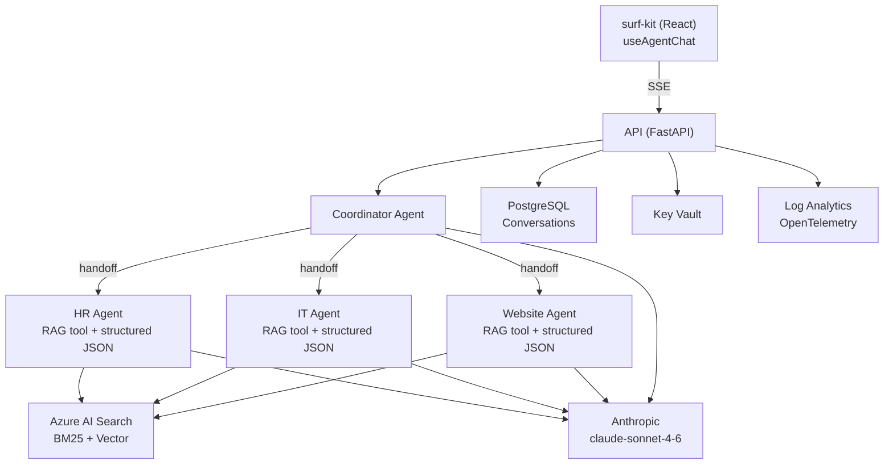
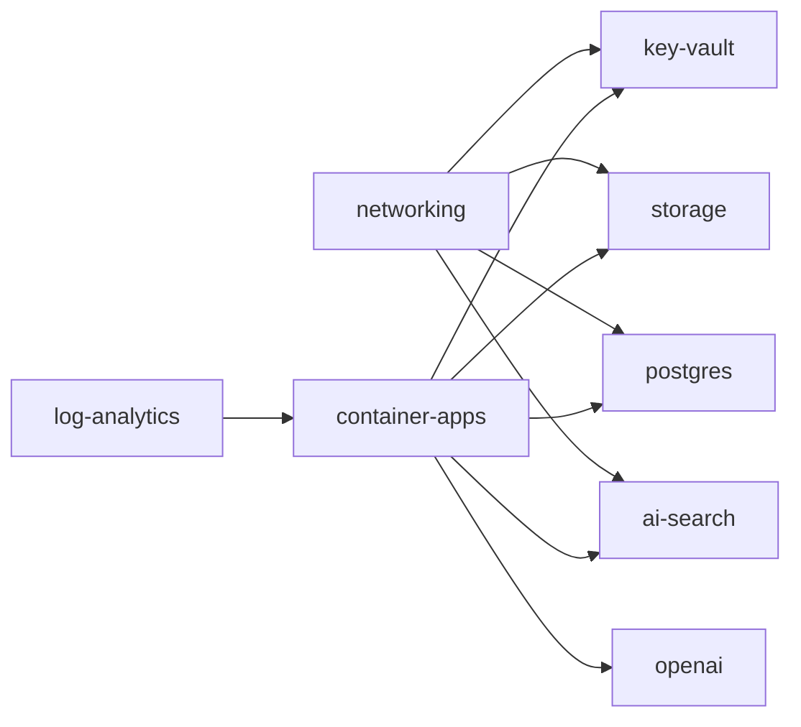

<div align="center">
  

# surf

**The open framework for extensible & grounded AI agent orchestration.**

_FastAPI · Anthropic Claude · Azure RAG · PostgreSQL_

[](https://github.com/barney-w/surf/actions/workflows/pr-checks.yml)
[](https://www.python.org/)
[](https://github.com/barney-w/surf-kit)
[](./LICENSE)

[What is Surf?](#what-is-surf) · [Architecture](#architecture) · [Quick Start](#quick-start) · [Development](#development) · [Contributing](./CONTRIBUTING.md)

</div>

---

## What is Surf?

Surf is an open-source platform for building **multi-agent AI assistants** grounded in organisational knowledge. It combines a multi-agent orchestration layer, a retrieval augmented generation (RAG) pipeline with hybrid search, a document ingestion pipeline (PDFs, SharePoint, website crawling), and three frontend channels — web, native desktop, and native mobile.

Surf is **domain-agnostic**. It ships with HR, IT, and Website specialist agents out of the box, but adding a new agent is as simple as subclassing `DomainAgent` — agents auto-register, inherit scoped RAG tools, load domain-specific skills on demand, and participate in routing without any wiring code.

### Highlights

- **Structured responses** with source citations, confidence scores, and follow-up suggestions
- **Hybrid search** combining keyword (BM25) and vector (HNSW) retrieval with chunk stitching
- **Real-time SSE streaming** with phase indicators (thinking, generating, verifying)
- **File attachments** — images and PDFs processed in-context via Claude vision
- **Auth-level gating** — agents declare public, Microsoft account, or organisational access levels
- **Guest access** — anonymous users get a scoped token for public-facing agents
- **Progressive skill loading** — agents discover and load domain expertise on demand

---

## Quick Start

### Prerequisites

- Python 3.12+
- Node.js 22+
- [uv](https://docs.astral.sh/uv/) for dependency management
- [just](https://github.com/casey/just) for task running
- [Docker Desktop](https://www.docker.com/products/docker-desktop/) for local PostgreSQL
- [Azure CLI](https://learn.microsoft.com/en-us/cli/azure/install-azure-cli)
- An Azure subscription with Azure OpenAI access
- **Desktop:** [Rust](https://rustup.rs/) toolchain (stable) — installed automatically via `rust-toolchain.toml`
- **Mobile:** [Expo CLI](https://docs.expo.dev/get-started/installation/) and platform SDKs (Xcode for iOS, Android Studio for Android)

### Setup

```bash
# 1. Install Python dependencies
cd api && uv sync && cd ../ingestion && uv sync && cd ..

# 2. Copy environment config (defaults work for local development)
cp .env.example .env

# 3. Start the API (auto-starts PostgreSQL via Docker)
just dev

# 4. Verify
curl http://localhost:8090/api/v1/health
```

> **Note:** Local development uses Docker for PostgreSQL. Azure resources (AI Search, OpenAI) are only needed for RAG features.

<details>
<summary><strong>Run with DevUI</strong></summary>

```bash
just devui
# Opens http://localhost:8091 in your browser
```

The DevUI is an interactive chat interface for testing agents directly. It provides full multi-turn conversation testing, per-agent message tracing, tool call visibility (RAG search queries and results), and streaming responses.

</details>

<details>
<summary><strong>Verify with a chat request</strong></summary>

```bash
curl -X POST http://localhost:8090/api/v1/chat \
  -H 'Content-Type: application/json' \
  -d '{"message": "How do I reset my password?"}'
```

</details>

---

## Architecture

<details>
<summary><strong>Architecture diagram (SVG)</strong></summary>

<div align="center">
  
</div>

</details>

<details open>
<summary><strong>Architecture diagram (Mermaid)</strong></summary>



</details>

---

## Project Structure

| Directory    | Description                                                                        | Key Tech                              |
| ------------ | ---------------------------------------------------------------------------------- | ------------------------------------- |
| `api/`       | FastAPI backend -- agents, routes, middleware, services                             | Python 3.12, FastAPI, Agent Framework |
| `web/`       | Web and desktop frontend -- Vite SPA with Tauri desktop shell                      | React 19, Vite, Tauri 2, Rust         |
| `mobile/`    | Mobile app -- iOS and Android                                                       | React Native, Expo 54, NativeWind     |
| `ingestion/` | Document ingestion pipeline -- PDF extraction, SharePoint sync, website crawling    | PyMuPDF, tiktoken, OpenAI embeddings  |
| `infra/`     | Azure infrastructure as code -- 8 Bicep modules, 3 environments                     | Bicep, Container Apps, VNet           |
| `data/`      | Sample documents and ingestion manifests                                            | HR/IT policy documents                |

---

## Agents

| Agent           | Purpose                                                                    | Auth Level       | RAG Domain     | Output Format                          |
| --------------- | -------------------------------------------------------------------------- | ---------------- | -------------- | -------------------------------------- |
| **Coordinator** | Routes queries to the right domain agent; synthesises multi-domain answers | All              | All (unscoped) | Plain text (streamed)                  |
| **HR Agent**    | Leave entitlements, onboarding, performance, policies, L&D                 | Microsoft account | `hr`           | Structured JSON (`AgentResponseModel`) |
| **IT Agent**    | VPN, passwords, software, hardware, email/Teams, security                  | Organisational   | `it`           | Structured JSON (`AgentResponseModel`) |
| **Website**     | Public website content -- services, facilities, events, locations          | Public           | Website metadata | Structured JSON (`AgentResponseModel`) |

Each domain agent has a scoped RAG tool and structured JSON output with source citations, confidence scores, and follow-up suggestions. New agents are added by subclassing `DomainAgent` -- auto-registered via `__init_subclass__`.

---

## Authentication

Surf uses **Microsoft Entra ID** for SSO across all three frontend channels, with platform-appropriate flows:

| Platform | Flow |
| -------- | ---- |
| Web (browser) | MSAL redirect |
| Desktop (Tauri) | MSAL redirect (dev) / popup (prod) |
| Mobile (Expo) | OAuth 2.0 Auth Code + PKCE |
| Guest (anonymous) | HMAC JWT via `POST /api/v1/auth/guest` |

Each agent declares an **auth level** (`public`, `microsoft`, or `organisational`). The coordinator builds auth-filtered agent graphs at request time -- guest users see only public agents, while organisational users see all agents.

---

## API Endpoints

| Method   | Endpoint                                  | Description                          |
| -------- | ----------------------------------------- | ------------------------------------ |
| `POST`   | `/api/v1/chat`                            | Chat -- returns JSON response        |
| `POST`   | `/api/v1/chat/stream`                     | Chat -- Server-Sent Events streaming |
| `GET`    | `/api/v1/chat/{conversation_id}`          | Load conversation history            |
| `DELETE` | `/api/v1/chat/{conversation_id}`          | Delete a conversation                |
| `POST`   | `/api/v1/chat/{conversation_id}/feedback` | Record thumbs up/down + comment      |
| `GET`    | `/api/v1/agents`                          | List available agents (auth-filtered) |
| `POST`   | `/api/v1/auth/guest`                      | Issue a guest token                  |
| `GET`    | `/api/v1/me`                              | Authenticated user profile           |
| `GET`    | `/api/v1/me/photo`                        | User profile photo (via Graph API)   |
| `GET`    | `/api/v1/health`                          | Health check                         |

<details>
<summary><strong>SSE Event Protocol</strong></summary>

```
phase(thinking) -> agent(name) -> phase(generating) -> delta* -> phase(verifying) -> confidence -> verification -> done -> [DONE]
```

- `:keepalive` comments sent every 5 seconds to keep the TCP connection alive
- `phase(waiting)` emitted after 10 seconds of no workflow output (e.g. during 429 retry)

</details>

---

## Infrastructure

| Service         | Bicep Module           | Purpose                                                |
| --------------- | ---------------------- | ------------------------------------------------------ |
| Azure OpenAI    | `openai.bicep`         | text-embedding-3-large embeddings (ingestion pipeline) |
| Azure AI Search | `ai-search.bicep`      | Hybrid BM25 + vector search for RAG                    |
| PostgreSQL      | *(local Docker)*       | Conversation storage with user-based isolation           |
| Container Apps  | `container-apps.bicep` | API + web + ingestion hosting (nginx proxy + FastAPI)  |
| Key Vault       | `key-vault.bicep`      | Secrets management                                     |
| Storage         | `storage.bicep`        | Document blob storage for ingestion                    |
| Log Analytics   | `log-analytics.bicep`  | OpenTelemetry traces + structured logs (30d retention) |
| VNet            | `networking.bicep`     | Private endpoints for all services                     |



Three environments: `dev.bicepparam`, `staging.bicepparam`, `prod.bicepparam`

---

## CI/CD

| Workflow            | Trigger                         | Purpose                                        |
| ------------------- | ------------------------------- | ---------------------------------------------- |
| **API CI/CD**       | Push to `main` (`api/**`)       | Lint, test, build and push API container       |
| **Ingestion CI/CD** | Push to `main` (`ingestion/**`) | Lint, test, build and push ingestion container |
| **Infra Deploy**    | Push to `main` (`infra/**`)     | Deploy Bicep modules to Azure                  |
| **PR Checks**       | Pull request to `main`          | Lint + test gate for all PRs                   |

Each workflow uses path filters so only relevant pipelines run per commit.

---

## Tech Stack

- **Python 3.12** with strict type checking
- **FastAPI 0.115+** with Pydantic 2 models
- **agent-framework** for multi-agent orchestration (HandoffBuilder, streaming)
- **Anthropic** -- claude-sonnet-4-6 (chat completions for all agents)
- **React 19** -- web and desktop frontend (surf-kit component library)
- **Tauri 2** -- desktop app shell (Rust backend, web frontend)
- **Expo 54 / React Native** -- iOS and Android mobile app
- **Azure OpenAI** -- text-embedding-3-large (ingestion embeddings only)
- **Azure AI Search** -- hybrid vector + BM25 retrieval
- **PostgreSQL** -- relational database with user-based isolation
- **OpenTelemetry** -- distributed tracing and structured logging
- **Bicep** -- infrastructure as code (8 modules, 3 environments)
- **uv** for dependency management
- **just** for task running
- **ruff** for linting and formatting
- **pyright** for static type analysis
- **clippy** + **rustfmt** for Rust linting and formatting
- **Locust** for load testing

---

## Development

| Command               | Description                                        |
| --------------------- | -------------------------------------------------- |
| `just dev`            | Run API with hot reload (port 8090)                |
| `just devui`          | Launch DevUI -- interactive agent chat (port 8091) |
| `just web`            | Run web frontend in dev mode (Vite)                |
| `just desktop`        | Run desktop app in dev mode (Tauri + Vite)         |
| `just desktop-build`  | Build desktop app for production                   |
| `just mobile`         | Start mobile Expo dev server                       |
| `just mobile-ios`     | Start mobile app on iOS simulator                  |
| `just mobile-android` | Start mobile app on Android emulator               |
| `just test`           | Run API tests                                      |
| `just test-ingestion` | Run ingestion tests                                |
| `just lint`           | Lint all code                                      |
| `just typecheck`      | Type-check all code                                |
| `just format`         | Format all code                                    |
| `just setup-dev`      | Deploy dev Azure resources + generate .env         |
| `just teardown-dev`   | Delete dev Azure resources                         |
| `just db`             | Start local PostgreSQL                             |
| `just db-shell`       | Open interactive psql session                      |
| `just db-reset`       | Reset database (truncate tables, keep schema)      |
| `just db-destroy`     | Full database teardown (remove volume)             |
| `just admin`          | Open dev admin page (conversation browser)         |
| `just api-deploy`     | Build, push and deploy API container to Azure      |
| `just web-deploy`     | Build and deploy web frontend container to Azure   |
| `just deploy`         | Deploy both API and web frontend                   |

```bash
git clone https://github.com/barney-w/surf.git
cd surf
cd api && uv sync && cd ../ingestion && uv sync && cd ..
just dev
```

---

## Deploying to Azure (Local)

You can deploy the API and web frontend from your local machine without CI/CD. Requires Docker Desktop running and `az login` authenticated.

### API

```bash
just api-deploy
```

This builds the Docker image, pushes it to your ACR, and updates the Container App. On Windows use `pwsh scripts/api-deploy.ps1`. See `justfile` for configurable defaults.

### Web Frontend

```bash
just web-deploy
```

This builds the Vite SPA (with Entra auth env vars), builds the nginx Docker image, pushes to ACR, and updates the web Container App. On Windows use `pwsh scripts/web-deploy.ps1`.

### Both

```bash
just deploy
```

---

## DevUI

Interactive chat interface for testing the AI workflow without the surf-kit frontend. Connects to the same Anthropic and Azure AI Search resources as the API.

- Full multi-turn conversation testing
- Per-agent message tracing
- Tool call visibility (RAG search queries and results)
- Streaming responses

> Runs on port 8091, separate from API on 8090. Both can run simultaneously.

---

## SharePoint Indexing

Surf can sync files and pages from SharePoint into Azure AI Search so agents can answer questions grounded in your SharePoint content. Quick version (after configuring `.env`):

```bash
just test-sharepoint-e2e    # sync -> setup indexer -> run indexer -> validate
just diagnose-sharepoint    # check blobs, index, and indexer status
```

---

## Documentation & Resources

| Resource            | Link                                                       |
| ------------------- | ---------------------------------------------------------- |
| Desktop App         | [docs/tauri-desktop-app.md](./docs/tauri-desktop-app.md)   |
| Load Testing        | [api/tests/load/README.md](./api/tests/load/README.md)     |
| Contributing        | [CONTRIBUTING.md](./CONTRIBUTING.md)                       |
| Code of Conduct     | [CODE_OF_CONDUCT.md](./CODE_OF_CONDUCT.md)                 |
| Security            | [SECURITY.md](./SECURITY.md)                               |

---

[Apache-2.0](./LICENSE)
