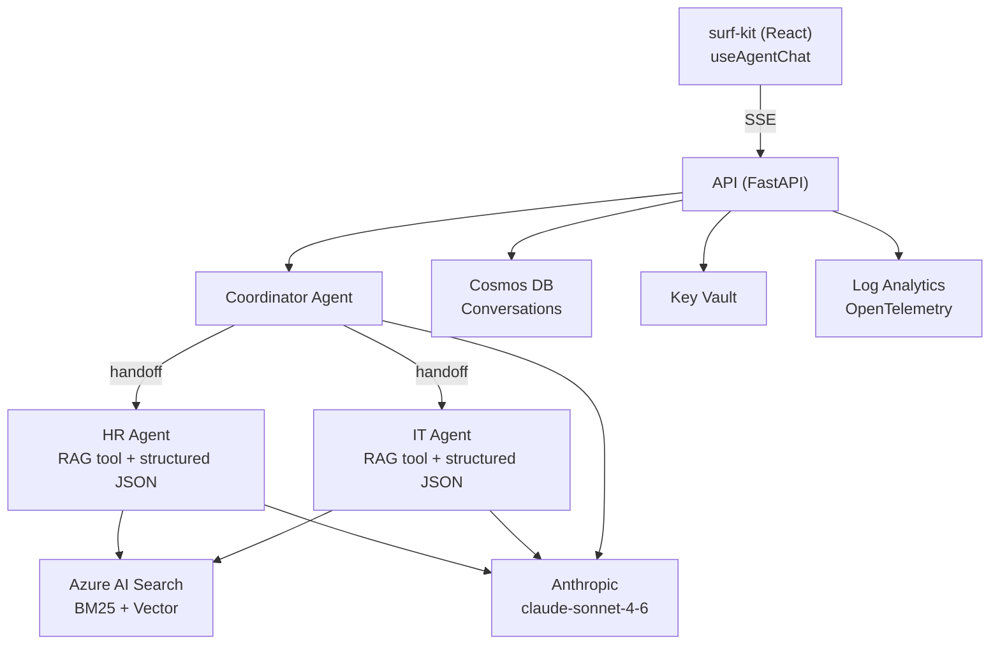
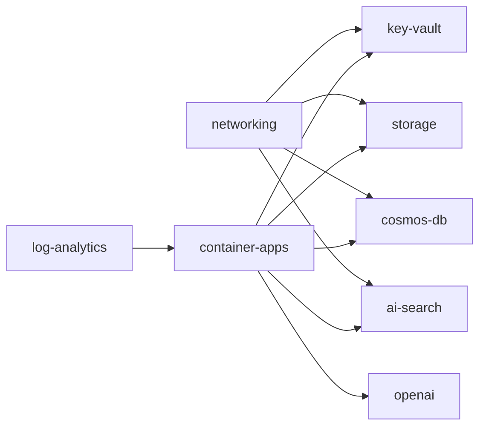

<div align="center">
  

# surf

**The open framework for extensible & grounded AI agent orchestration.**

_FastAPI · Anthropic Claude · Azure RAG · Cosmos DB_

[](https://github.com/barney-w/surf/actions)
[](https://www.python.org/)
[](https://github.com/barney-w/surf-kit)
[](./LICENSE)

[Architecture](#architecture) · [Quick Start](#quick-start) · [Development](#development) · [Contributing](./CONTRIBUTING.md)

</div>

---

## Quick Start

### Prerequisites

- Python 3.12+
- [uv](https://docs.astral.sh/uv/) for dependency management
- [just](https://github.com/casey/just) for task running
- [Azure CLI](https://learn.microsoft.com/en-us/cli/azure/install-azure-cli)
- An Azure subscription with Azure OpenAI access

### Setup

```bash
# 1. Log in to Azure
az login

# 2. Install Python dependencies
cd api && uv sync && cd ../ingestion && uv sync && cd ..

# 3. Deploy dev Azure resources and generate .env (~5 min)
just setup-dev

# 4. Start the API
just dev

# 5. Verify
curl http://localhost:8090/api/v1/health
```

> **Note:** RBAC role propagation can take a few minutes after deployment. If you get 403 errors, wait a minute and retry.

<details>
<summary><strong>Run with DevUI</strong></summary>

```bash
just devui
# Opens http://localhost:8091 in your browser
```

The DevUI is an interactive chat interface for testing agents directly. It provides full multi-turn conversation testing, per-agent message tracing, tool call visibility (RAG search queries and results), and streaming responses.

</details>

<details>
<summary><strong>Verify with a chat request</strong></summary>

```bash
curl -X POST http://localhost:8090/api/v1/chat \
  -H 'Content-Type: application/json' \
  -d '{"message": "How do I reset my password?"}'
```

</details>

---

## Architecture

<div align="center">
  
</div>

<details open>
<summary><strong>Text-based diagram (Mermaid)</strong></summary>



</details>

---

## Project Structure

| Directory    | Description                                                                  | Key Tech                              |
| ------------ | ---------------------------------------------------------------------------- | ------------------------------------- |
| `api/`       | FastAPI backend -- agents, routes, middleware, services                      | Python 3.12, FastAPI, Agent Framework |
| `ingestion/` | Document ingestion pipeline -- PDF extraction, chunking, embedding, indexing | PyMuPDF, tiktoken, OpenAI embeddings  |
| `infra/`     | Azure infrastructure as code -- 8 Bicep modules, 3 environments              | Bicep, Container Apps, VNet           |
| `data/`      | Sample documents and ingestion manifests                                     | HR/IT policy documents                |

---

## Agents

| Agent           | Purpose                                                                    | RAG Domain     | Output Format                          |
| --------------- | -------------------------------------------------------------------------- | -------------- | -------------------------------------- |
| **Coordinator** | Routes queries to the right domain agent; synthesises multi-domain answers | All (unscoped) | Plain text (streamed)                  |
| **HR Agent**    | Leave entitlements, onboarding, performance, policies, L&D                 | `hr`           | Structured JSON (`AgentResponseModel`) |
| **IT Agent**    | VPN, passwords, software, hardware, email/Teams, security                  | `it`           | Structured JSON (`AgentResponseModel`) |

Each domain agent has a RAG tool and structured JSON output. New agents are added by subclassing `DomainAgent` -- auto-registered via `__init_subclass__`.

---

## API Endpoints

| Method   | Endpoint                                  | Description                          |
| -------- | ----------------------------------------- | ------------------------------------ |
| `POST`   | `/api/v1/chat`                            | Chat -- returns JSON response        |
| `POST`   | `/api/v1/chat/stream`                     | Chat -- Server-Sent Events streaming |
| `GET`    | `/api/v1/chat/{conversation_id}`          | Load conversation history            |
| `DELETE` | `/api/v1/chat/{conversation_id}`          | Delete a conversation                |
| `POST`   | `/api/v1/chat/{conversation_id}/feedback` | Record thumbs up/down + comment      |
| `GET`    | `/api/v1/health`                          | Health check                         |

<details>
<summary><strong>SSE Event Protocol</strong></summary>

```
phase(thinking) -> agent(name) -> phase(generating) -> delta* -> phase(verifying) -> confidence -> verification -> done -> [DONE]
```

- `:keepalive` comments sent every 5 seconds to keep the TCP connection alive
- `phase(waiting)` emitted after 10 seconds of no workflow output (e.g. during 429 retry)

</details>

---

## Infrastructure

| Service         | Bicep Module           | Purpose                                                |
| --------------- | ---------------------- | ------------------------------------------------------ |
| Azure OpenAI    | `openai.bicep`         | text-embedding-3-large embeddings (ingestion pipeline) |
| Azure AI Search | `ai-search.bicep`      | Hybrid BM25 + vector search for RAG                    |
| Cosmos DB       | `cosmos-db.bicep`      | Serverless conversation storage (`/user_id` partition) |
| Container Apps  | `container-apps.bicep` | API (0--3 replicas) + ingestion (0--1) hosting         |
| Key Vault       | `key-vault.bicep`      | Secrets management                                     |
| Storage         | `storage.bicep`        | Document blob storage for ingestion                    |
| Log Analytics   | `log-analytics.bicep`  | OpenTelemetry traces + structured logs (30d retention) |
| VNet            | `networking.bicep`     | Private endpoints for all services                     |



Three environments: `dev.bicepparam`, `staging.bicepparam`, `prod.bicepparam`

---

## CI/CD

| Workflow            | Trigger                         | Purpose                                        |
| ------------------- | ------------------------------- | ---------------------------------------------- |
| **API CI/CD**       | Push to `main` (`api/**`)       | Lint, test, build and push API container       |
| **Ingestion CI/CD** | Push to `main` (`ingestion/**`) | Lint, test, build and push ingestion container |
| **Infra Deploy**    | Push to `main` (`infra/**`)     | Deploy Bicep modules to Azure                  |
| **PR Checks**       | Pull request to `main`          | Lint + test gate for all PRs                   |

Each workflow uses path filters so only relevant pipelines run per commit.

---

## Tech Stack

- **Python 3.12** with strict type checking
- **FastAPI 0.115+** with Pydantic 2 models
- **agent-framework** for multi-agent orchestration (HandoffBuilder, streaming)
- **Anthropic** -- claude-sonnet-4-6 (chat completions for all agents)
- **Azure OpenAI** -- text-embedding-3-large (ingestion embeddings only)
- **Azure AI Search** -- hybrid vector + BM25 retrieval
- **Cosmos DB** -- serverless NoSQL with user-based partitioning
- **OpenTelemetry** -- distributed tracing and structured logging
- **Bicep** -- infrastructure as code (8 modules, 3 environments)
- **uv** for dependency management
- **just** for task running
- **ruff** for linting and formatting
- **pyright** for static type analysis
- **Locust** for load testing

---

## Development

| Command               | Description                                        |
| --------------------- | -------------------------------------------------- |
| `just dev`            | Run API with hot reload (port 8090)                |
| `just devui`          | Launch DevUI -- interactive agent chat (port 8091) |
| `just test`           | Run API tests                                      |
| `just test-ingestion` | Run ingestion tests                                |
| `just lint`           | Lint all code                                      |
| `just typecheck`      | Type-check all code                                |
| `just format`         | Format all code                                    |
| `just setup-dev`      | Deploy dev Azure resources + generate .env         |
| `just teardown-dev`   | Delete dev Azure resources                         |

```bash
git clone https://github.com/barney-w/surf.git
cd surf
cd api && uv sync && cd ../ingestion && uv sync && cd ..
just dev
```

---

## DevUI

Interactive chat interface for testing the AI workflow without the surf-kit frontend. Connects to the same Anthropic and Azure AI Search resources as the API.

- Full multi-turn conversation testing
- Per-agent message tracing
- Tool call visibility (RAG search queries and results)
- Streaming responses

> Runs on port 8091, separate from API on 8090. Both can run simultaneously.

---

## Documentation & Resources

| Resource        | Link                                                   |
| --------------- | ------------------------------------------------------ |
| Load Testing    | [api/tests/load/README.md](./api/tests/load/README.md) |
| Contributing    | [CONTRIBUTING.md](./CONTRIBUTING.md)                   |
| Code of Conduct | [CODE_OF_CONDUCT.md](./CODE_OF_CONDUCT.md)             |
| Security        | [SECURITY.md](./SECURITY.md)                           |

---

[Apache-2.0](./LICENSE)
